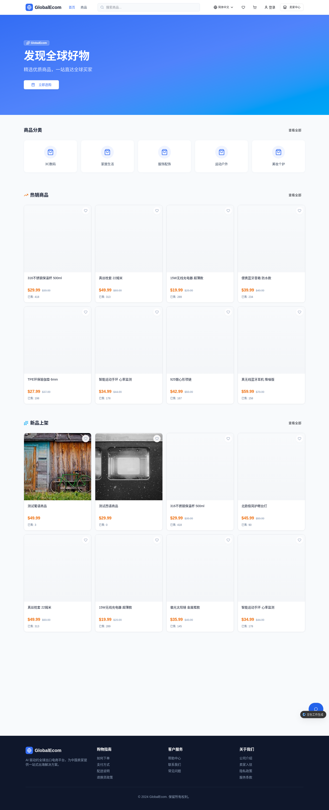
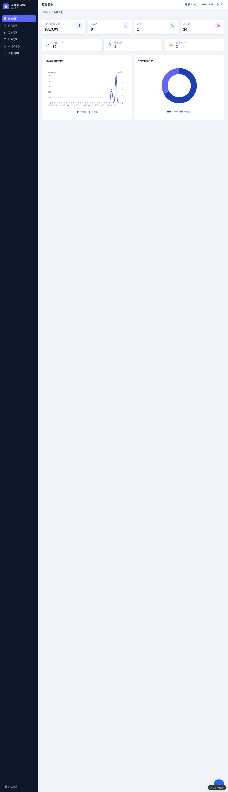
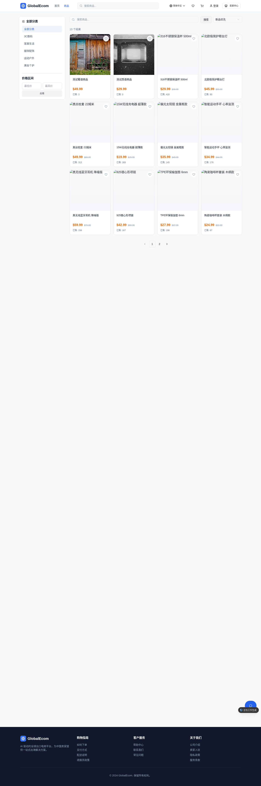
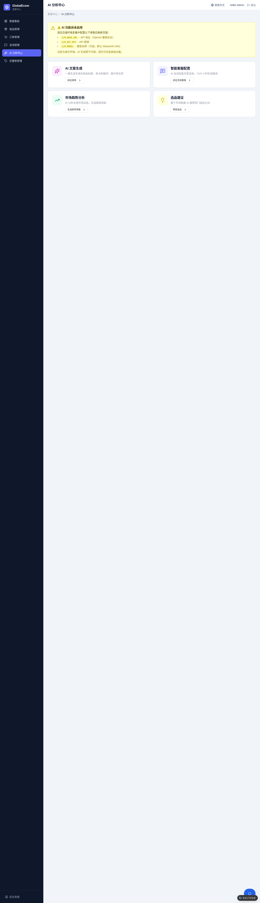
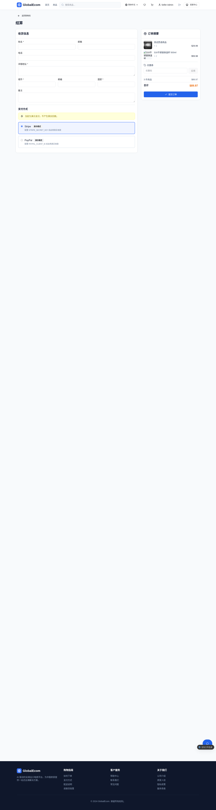
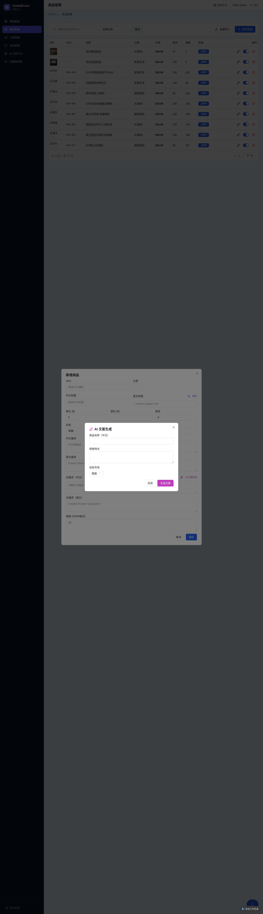
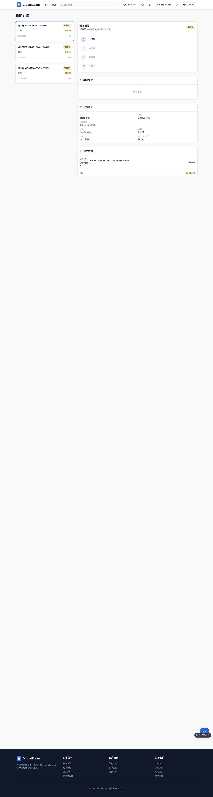
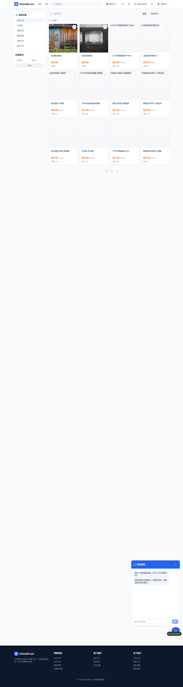

<div align="center">


# GlobalEcom AI

### AI 原生跨境出货台 · AI-Native Cross-Border Commerce Platform

#### *AI 让跨境生意更简单 · Make Cross-Border Business Simpler with AI*

买家商城 + 卖家 AI 工作台双端一体，5 个 AI Agent 真实驱动商品文案、智能客服、趋势分析、选品建议与多语言翻译。

One codebase, two experiences — a B2C buyer storefront and a seller AI workbench, powered by 5 real AI Agents for copywriting, support, trend analysis, product selection and translation.

[](https://github.com/X33834/GlobalEcom-AI)
[](https://gitee.com/badhope/GlobalEcom-AI)
[](https://gitcode.com/badhope/GlobalEcom-AI)
[](https://github.com/X33834/GlobalEcom-AI/releases/tag/v1.0.0)
[](https://github.com/X33834/GlobalEcom-AI)
[](https://github.com/X33834/GlobalEcom-AI/actions)
[](LICENSE)
[]()
[](CONTRIBUTING.md)

</div>

---

**GlobalEcom AI** 是一套 **AI 原生的出口电商全栈平台**，面向跨境卖家提供"开店 → 上架 → 获客 → 成交 → 客服 → 复盘"的完整闭环。平台采用买家商城（B2C）与卖家 AI 工作台双端同仓架构，内置 **5 个真实调用大模型的 AI Agent**，帮助卖家以更低成本完成商品文案生成、多语言翻译、智能客服、趋势分析与选品决策。

**GlobalEcom AI** is a full-stack, AI-native cross-border e-commerce platform delivering the complete loop: *launch → list → attract → convert → support → review*. With a buyer storefront and a seller AI workbench in one monorepo, its 5 AI Agents help sellers cut cost and effort in copywriting, translation, customer support, trend analysis and product selection.

- **品牌定位 / Positioning**：AI 原生跨境出货台 · AI-Native Cross-Border Commerce Platform
- **主传播语 / Tagline**：AI 让跨境生意更简单 · Make Cross-Border Business Simpler with AI
- **主色 / Brand Colors**：深海军蓝 `#0B1F3A` + 科技青 `#00C2B8`
- **当前版本 / Version**：v1.0.0（[CHANGELOG.md](CHANGELOG.md)）

---

## 产品截图 · Screenshots

| 买家商城 Buyer Storefront | 卖家 AI 工作台 Seller AI Workbench |
|:---:|:---:|
|  |  |
| 首页推荐 · 分类导航 · 多语言（zh / en / es / pt） | GMV / 订单量 / 访客数，SQL 真实聚合 + ECharts |
|  |  |
| 筛选 · 排序 · 分页 · 关键词搜索（pg_trgm） | 5 个 AI Agent 入口 + 调用用量统计 |
|  |  |
| Stripe / PayPal 演示接入 · 优惠券 · 金额后端重算 | CopywriterAgent 生成标题 / 卖点 / SEO 关键词 |
|  |  |
| 订单列表 · 物流时间线（17TRACK 接入点） | SupportAgent 三层 RAG 智能客服 |

> 全部 16 张页面截图见 [`docs/screenshots/`](docs/screenshots/)。

---

## 核心功能 · Features

### 买家商城（B2C）· Buyer Storefront

- **浏览与搜索**：首页推荐、分类导航、商品列表筛选 / 排序 / 分页、关键词搜索（`pg_trgm` 模糊匹配）
- **购物车**：增删改、数量调整、价格实时计算；匿名购物车支持**跨设备"迁移码"恢复**
- **下单与支付**：收货信息校验、Stripe / PayPal 演示接入（未配 key 走演示支付）、**金额后端重算**（不信任前端金额）
- **订单跟踪**：订单列表、详情、物流时间线（17TRACK 接入点，未配 key 走演示时间线）
- **评价与收藏**：已购用户可评价、心形收藏、我的收藏页
- **优惠券**：结算时输入折扣码，**原子核销防超用**
- **多语言**：界面与商品内容支持 **zh / en / es / pt** 四语言切换

### 卖家 AI 工作台 · Seller AI Workbench

- **运营看板**：GMV / 订单量 / 访客数，SQL 真实聚合 + ECharts 图表
- **商品管理**：CRUD、上下架、库存、**CSV 批量导入**（≤10MB）
- **订单管理**：列表、状态流转、发货、物流录入
- **咨询管理**：买家咨询会话列表与回复（SupportAgent 自动回复 + 人工兜底）
- **AI 分析中心**：5 个 Agent 入口 + AI 调用用量统计（token / 耗时 / 成功率）
- **优惠券管理**：卖家创建折扣码、查看核销记录
- **操作审计日志**：9 类写操作前后值 diff + IP，可筛选回看

---

## 5 个 AI Agent · All Real, No Fake

所有 Agent 均为**真实 LLM 调用**（OpenAI 兼容协议），统一经 `ai-gateway` 收口；未配 key 时诚实报错 400，**绝不返回假数据**。

| Agent | 职责 · Responsibility | 模型 · Model | 关键实现 |
|---|---|---|---|
| **CopywriterAgent** | 商品文案生成（标题 / 卖点 / 长描述 / SEO 关键词） | DeepSeek-chat | 强制 JSON 输出，写回商品多语言字段 |
| **SupportAgent** | RAG 智能客服 | DeepSeek-chat | 三层检索：pgvector 向量召回 → 关键词回退 → FAQ + 订单摘要 |
| **TrendAgent** | 趋势分析报告 | DeepSeek-reasoner | SQL 聚合近 30 天销售数据 + LLM 解读，落库可回看 |
| **SelectAgent** | 选品建议 | DeepSeek-chat | 类目 + Top 20 热销 + 趋势摘要 → JSON 推荐 |
| **TranslationAgent** | 多语言翻译 | DeepSeek-chat | 支持 **12 种语言**（zh/en/es/pt/fr/de/it/ja/ko/ru/ar/th） |

> 详细输入输出、降级行为与环境变量说明见 [docs/AI-AGENTS.md](docs/AI-AGENTS.md)。

---

## 技术栈 · Tech Stack

| 层 · Layer | 技术 · Technology |
|---|---|
| 前端 Frontend | React 19 · TypeScript · Vite · Tailwind CSS · shadcn/ui · React Router v6 · ECharts |
| 后端 Backend | NestJS 10 · TypeScript · Drizzle ORM |
| 数据库 Database | PostgreSQL 16（`pgvector` 向量检索 + `pg_trgm` 模糊搜索扩展） |
| AI 调用 AI | OpenAI 兼容协议（DeepSeek / 火山方舟 / OpenAI / 通义 / 智谱等） |
| 认证 Auth | JWT（HttpOnly Cookie）+ bcrypt + Google OAuth + CSRF 头校验 |
| 支付 Payments | Stripe / PayPal（演示模式，配 key 即真实收款） |
| 部署 Deploy | Docker Compose 一键启动 · 单 VPS 即可运行 |

---

## 架构总览 · Architecture

```
┌────────────────────────────────────────────────────────────┐
│                        浏览器 / Browser                      │
│  买家商城 (B2C)         卖家 AI 工作台 (Seller Workbench)     │
│  React 19 + Vite       React 19 + Vite + ECharts            │
│  └─────────┬───────────────────────────┬──────────────────┘ │
│            │  credentials: include (HttpOnly Cookie)         │
└────────────┼───────────────────────────┼────────────────────┘
             ▼                           ▼
┌────────────────────────────────────────────────────────────┐
│               NestJS 10 API 网关（单一 Node 进程）            │
│  middleware: jwt-auth → csrf-header → rate-limit            │
│  guards: RolesGuard (buyer/seller) · filter: 异常脱敏         │
│  modules: auth products categories cart orders payments      │
│           reviews favorites coupons inquiry logistics        │
│           dashboard audit ai (5 Agent + ai-gateway)          │
└──────────────┬──────────────────────────┬────────────────────┘
               │                          │
               ▼                          ▼
   ┌────────────────────┐    ┌──────────────────────────────┐
   │  PostgreSQL 16     │    │  OpenAI 兼容 LLM 端点          │
   │  + pgvector        │◄──►│  DeepSeek / 火山方舟 / ...    │
   │  + pg_trgm         │    │  /v1/chat/completions         │
   │  Drizzle ORM       │    │  /v1/embeddings               │
   └────────────────────┘    └──────────────────────────────┘
              ▲
              │
   Stripe / PayPal / 17TRACK / Google OAuth
```

> 数据库表结构、AI Gateway 调用链路、认证与 CSRF 方案详见 [docs/ARCHITECTURE.md](docs/ARCHITECTURE.md)。

---

## 快速开始 · Quick Start

### 方式一：Docker 一键启动（推荐）· Recommended

**前置要求**：Docker ≥ 24.x + Docker Compose ≥ v2；可用外网（调用 LLM / Stripe / PayPal / 17TRACK API）。

```bash
# 1. 克隆代码
git clone https://github.com/X33834/GlobalEcom-AI.git
cd GlobalEcom-AI

# 2. 复制环境变量模板并填入密钥
cp .env.example .env        # 至少设置 JWT_SECRET；其余未配自动进入演示模式

# 3. 启动全部服务（postgres 自动建库 + pgvector/pg_trgm 扩展）
docker compose up -d --build

# 4. 访问
#    买家商城   http://localhost:3000/
#    卖家工作台 http://localhost:3000/seller/dashboard
```

> **未配 key 的能力自动进入演示模式，不会阻断启动。** 完整密钥清单、常用命令、常见问题见 [docs/DEPLOY.md](docs/DEPLOY.md)。

### 演示账号 · Demo Account

| 角色 Role | 账号 | 密码 |
|---|---|---|
| 卖家 Seller | `seller@example.com` | `seller123` |
| 优惠码 Coupon | `TEST10` | 九折 |

### 本地开发 · Local Development

```bash
npm install          # 安装依赖（含 postinstall 钩子初始化）
npm run dev          # 同时启动前端 (Vite) 与后端 (NestJS watch)
npm run lint         # ESLint + Stylelint
npm run type:check   # 前后端 TypeScript 类型检查
```

---

## 文档目录 · Documentation

| 文档 | 说明 |
|---|---|
| [docs/ARCHITECTURE.md](docs/ARCHITECTURE.md) | 整体架构、数据库表、AI Gateway 调用链路、认证与 CSRF 方案 |
| [docs/AI-AGENTS.md](docs/AI-AGENTS.md) | 5 个 AI Agent 的输入输出、模型、降级行为与环境变量 |
| [docs/DEPLOY.md](docs/DEPLOY.md) | 部署指南：环境要求、密钥清单、一键启动、备份与升级、常见问题 |
| [docs/audit-summary.md](docs/audit-summary.md) | 历史检查与修复摘要（v0.1.0 → v1.0.0） |
| [CHANGELOG.md](CHANGELOG.md) | 版本变更历史（Keep a Changelog 格式） |
| [CONTRIBUTING.md](CONTRIBUTING.md) | 贡献指南：环境、规范、提交与 PR 流程 |
| [SECURITY.md](SECURITY.md) | 安全策略：漏洞报告与处理流程 |
| [CODE_OF_CONDUCT.md](CODE_OF_CONDUCT.md) | 社区行为准则 |

---

## 路线图 · Roadmap

| 阶段 | 状态 | 内容 |
|---|---|---|
| **MVP** | ✅ 已完成 v1.0.0 | 交易闭环、5 AI Agent 链路、安全基线、Docker 部署 |
| **迭代 1** | 🔄 部分完成 | 多语言 es/pt 已落地；PayPal / 17TRACK 真实接入待配 key |
| **迭代 2** | 📋 规划中 | 邮件营销、库存预警、多店铺数据对比 |
| **迭代 3** | 📋 规划中 | 多卖家平台化（SaaS 模式）、应用市场、按成交抽佣 |

---

## 贡献 · Contributing

欢迎任何形式的贡献：提交 Issue、修复 Bug、完善文档、增加功能。

- 报告问题：[GitHub Issues](https://github.com/X33834/GlobalEcom-AI/issues)
- 提交代码：请先阅读 [CONTRIBUTING.md](CONTRIBUTING.md)，遵循既有代码规范与提交信息格式
- 行为准则：所有参与者请遵守 [CODE_OF_CONDUCT.md](CODE_OF_CONDUCT.md)

如果这个项目对你有帮助，欢迎 **Star** ⭐ 支持我们，让更多跨境卖家看到它。

If you find this project useful, please give it a **Star** ⭐ so more cross-border sellers can benefit from it.

---

## 安全 · Security

本项目重视安全。我们已完成 P0 致命 14 项 + P1 重要 16 项 + P2 加固 4 项的修复（详见 [docs/audit-summary.md](docs/audit-summary.md)）。发现安全问题请通过 [SECURITY.md](SECURITY.md) 中说明的方式私密报告，请勿在公开 Issue 中披露。

---

## 许可证 · License

本项目采用 **MIT License** 开源，详见 [LICENSE](LICENSE)。

版权所有 © 2026 GlobalEcom AI. All rights reserved.

